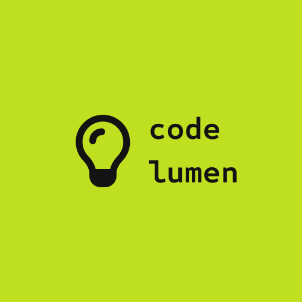
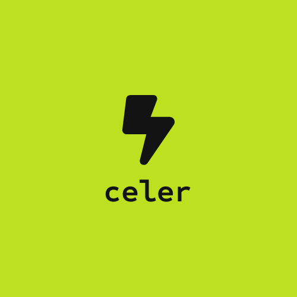

# vigil

A monorepo containing design systems, code conventions, client bootstrap projects, and AI tooling for battoni.dev.

<div align="center">
  
  
  
</div>

<div align="center" style="margin-top: 10px">
  
  
  
</div>

## 🛰️ Vigil — Self-Hosted Monitoring System (MVP)

> On the `feature/vigil-mvp` branch, **`api.vigil/` (backend) and `app.vigil/` (frontend)
> together implement the Vigil monitoring product** — not just the bootstraps described
> further below.

**What it is.** Vigil is a standalone uptime/monitoring system you run on your own
infrastructure and point at any site or endpoint. It gives you:

- **Monitors** — HTTP, TCP, SSL-expiry, and push **heartbeat** checks, each with a
  configurable interval (min 60s) and confirmation/recovery thresholds.
- **A check engine** — a per-minute scheduler dispatches due checks to a queue; workers
  run them, confirm UP/DOWN transitions, and open/resolve **incidents**.
- **Resilient alerting** — a WhatsApp → Slack → Email fallback chain (email itself is
  Resend → SMTP), with de-duplication and quiet-hours deferral.
- **Uptime history** — raw results roll up into hourly/daily aggregates; the dashboard
  shows uptime % (24h/7d/30d/90d), latency and uptime charts, and recent checks.
- **Public status pages** — a public, no-login board per project at `/status/{slug}`.
- **SSRF protection** — user-supplied targets are vetted (private/loopback/metadata
  ranges blocked) at create-time and on every redirect hop.

Architecture, decisions, and the production Docker topology live in
[`PLAN.md`](./PLAN.md); the frontend plan is in [`APP_PLAN.md`](./APP_PLAN.md).

---

### ▶️ Install & run (Linux + Laravel Valet)

> These steps assume you already run the bootstrap (pendulum) locally with **Valet**,
> **PHP 8.4**, **Composer**, **Node (see `.nvmrc`)** and **MySQL 8**.
> **Redis is _not_ required** for this MVP — the queue and cache use the database driver.

**1. Get the branch**

```bash
git clone git@github.com:battoni/vigil.git      # or: cd into your existing clone
cd vigil
git checkout feature/vigil-mvp
```

**2. Backend — `api.vigil`**

```bash
cd api.vigil
composer install

# ⚠️ EDIT api.vigil/.env — set DB_DATABASE / DB_USERNAME / DB_PASSWORD to YOUR local
# MySQL. The committed values are the original dev's and will NOT match your machine.
# Create the database first, e.g.:
mysql -u root -p -e "CREATE DATABASE IF NOT EXISTS vigil;"

php artisan migrate:fresh --seed        # (or: make migrate-fresh) — seeds the admin + a System project

valet link api.vigil                    # serves https://api.vigil.test  (same pattern as pendulum)
valet secure api.vigil                  # TLS cert
```

Check it: open **https://api.vigil.test/up** → should return a blank **200**.

**3. Run the check engine** — open **two** terminals in `api.vigil/` (both must stay running
for monitors to actually run):

```bash
php artisan schedule:work    # terminal 1 — the per-minute dispatcher (the "tick")
php artisan queue:work       # terminal 2 — the worker that runs checks + sends alerts
```

**4. Frontend — `app.vigil`**

```bash
cd ../app.vigil
nvm use                      # matches .nvmrc
npm install
npm run dev                  # serves https://app.vigil.test:5173 using your Valet TLS cert
```

The frontend `.env` is committed and already points at `https://api.vigil.test/api`.

**5. Log in** — open **https://app.vigil.test:5173** and sign in:

| Field | Value |
| --- | --- |
| Username | `battoni` |
| Password | `12345678` |

**6. First smoke (do this once to confirm it's alive)**

1. You land on the dashboard; the **project switcher** (top of the page) shows **System**.
2. Go to **Monitors → New monitor**, type **HTTP**, target `https://example.com`, interval 60s, create it.
3. With `schedule:work` + `queue:work` running, it flips from **Pending** to **Up** within ~1–2 minutes.
4. Open the monitor (eye icon) → detail page with uptime cards, charts, recent checks.
5. Go to **Status pages → New**, mark it **public**, then **Manage monitors** and add your monitor.
6. Open `https://app.vigil.test:5173/status/<slug>` in a **private/incognito window** (no login) → the public board renders.

**Good-to-know (avoids confusion):**

- **The #1 gotcha is the DB credentials** in `api.vigil/.env` — update them to your local MySQL or nothing works.
- **Login is username + password** (`VITE_LOGIN_FLOW=username`). No email/OTP needed.
- **Mail uses the `log` driver** — alert emails land in `api.vigil/storage/logs/laravel.log`, not a real inbox.
- **WhatsApp/Slack/real email delivery need real credentials.** You can create channels and attach them, but actual delivery requires configuring Evolution/Slack webhook/Resend. For QA, focus on monitor state + incidents + the dashboard; channel *delivery* is out of scope without those.
- **Monitors only run while both `schedule:work` and `queue:work` are running.**

---

## Projects

### Arcus

**Laravel API bootstrap** — starting point for backend APIs.

- Laravel 13, PHP 8.4, DDD-style module structure
- RESTful API with Spatie Data DTOs, Eloquent Resources, role-based permissions
- AI-ready: rules, skills, and commands configured at monorepo root

[View Project](./api.vigil/)

---

### app.vigil

**Vue 3 client bootstrap** — starting point for web applications.

- Vue 3.5 + TypeScript, PrimeVue, Tailwind CSS, Pinia, Vue Router, Vue I18n
- ESLint + Prettier auto-fix on save
- Single-file theme system: change `src/styles/theme/colors.css` to retheme the entire project — semantic palette names (`primary`, `surface`, `ink`) propagate to PrimeVue tokens and Tailwind utilities automatically
- AI-ready: rules and commands configured at monorepo root

[View Project](./app.vigil/)

---

### Vitrum

**Astro bootstrap** — starting point for public, institutional and marketing websites.

- Astro, TypeScript, Tailwind CSS
- Static-first, SEO-ready, lightweight

[View Project](./vitrum/)

---

### Cortex

**AI knowledge layer** — history, documentation, and prompts for vigil's AI infrastructure.

- All rules live at the monorepo root (`.claude/rules/`, `.cursor/rules/`) and activate automatically by file path
- Commands: `/setup-project`, `/start-session`, `/reviewVueConventions`, `/reviewArcusCode`, `/reviewDesignConventions`, `/generateComponentRules`
- Skills, agents, and hooks for Claude Code; full rule parity for Cursor

[View AI Docs](./cortex/)

---

### CodeLumen

**Code conventions documentation** — VitePress site for battoni.dev standards.

- Comprehensive coding standards, Atomic Design, Domain-Driven Design

[View Documentation](./codelumen/)

---

### Liquen

**Design tokens and Figma integration** — design consistency across projects.

- Design token management with Tokens Studio
- Figma variable sync and theme customization

[View Project](./liquen/)

---

## License

Private project — All rights reserved.
